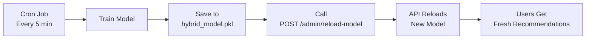

# Quick Start: Automated Model Training

Get your automated recommendation model retraining up and running in 5 minutes.

## Step 1: Install Dependencies

```bash
cd /Users/tanhtran/Documents/github/seed-service
pip install -r requirements.txt
```

## Step 2: Start the API Service

```bash
# Terminal 1: Start FastAPI service
uvicorn api.main:app --reload --host 0.0.0.0 --port 8000

# Wait for model to load (5-10 seconds)
# You should see: "Model loaded successfully!"
```

## Step 3: Set Up Automated Training (Cron Job)

```bash
# Terminal 2: Run setup script
./scripts/setup_cron.sh

# This will:
# - Create logs directory
# - Add cron job to run every 5 minutes
# - Configure logging
```

## Step 4: Verify Setup

```bash
# Check cron job is installed
crontab -l

# You should see:
# */5 * * * * cd /path/to/seed-service && python3 scripts/train_model_cron.py >> logs/cron.log 2>&1
```

## Step 5: Monitor Training

```bash
# Watch training logs (wait up to 5 minutes for first run)
tail -f logs/training.log

# You should see:
# ================================================================================
# Starting model training at 2025-12-24T10:00:00
# ================================================================================
# Step 1/5: Loading data from database...
# ...
# Training completed successfully in 45.23 seconds
```

## Step 6: Test Hot-Reload

```bash
# After training completes, reload the model in the API
curl -X POST http://localhost:8000/admin/reload-model

# Expected response:
# {
#   "success": true,
#   "message": "Model reloaded successfully",
#   "details": { "reloaded": true, ... }
# }
```

## Step 7: Test Recommendations

```bash
# Get a real user ID from your database
# Then test recommendations:
curl "http://localhost:8000/recommendations/YOUR_USER_ID?limit=20&offset=0"

# Expected response:
# {
#   "user_id": "...",
#   "recommendations": [...],
#   "pagination": { "total": 100, "limit": 20, "offset": 0, "has_more": true }
# }
```

## Complete Workflow



## Useful Commands

```bash
# Monitor training
tail -f logs/training.log

# Check model file age
ls -lh hybrid_model.pkl

# Reload model manually
curl -X POST http://localhost:8000/admin/reload-model

# Check model status
curl http://localhost:8000/admin/model-status

# Test recommendations
curl "http://localhost:8000/recommendations/USER_ID?limit=10"

# View API docs
open http://localhost:8000/docs
```

## Configuration

### Change Training Frequency

```bash
# Edit cron schedule
crontab -e

# Examples:
# Every 10 minutes: */10 * * * *
# Every hour:       0 * * * *
# Every 6 hours:    0 */6 * * *
# Daily at 2 AM:    0 2 * * *
```

### Disable Training

```bash
# Remove cron job
crontab -e
# Delete the line or comment it out with #
```

## Troubleshooting

### Training not running?

```bash
# Test manually
python3 scripts/train_model_cron.py

# Check cron service
pgrep cron

# View cron logs
tail -f logs/cron.log
```

### API not reloading?

```bash
# Check if model file was updated
ls -lh hybrid_model*.pkl

# Manual reload
curl -X POST http://localhost:8000/admin/reload-model

# Check API logs
tail -f logs/api.log
```

### Need more help?

See detailed documentation:
- [TRAINING.md](TRAINING.md) - Complete training documentation
- [README_API.md](README_API.md) - API documentation

## Next Steps

1. ✅ **Adjust frequency**: Change cron schedule based on your needs
2. ✅ **Monitor performance**: Watch training duration and model quality
3. ✅ **Integrate with NestJS**: Call the recommendation API from your backend
4. ✅ **Set up alerts**: Monitor training failures
5. ✅ **Optimize**: Tune model parameters for your use case

**You're all set! 🚀**
